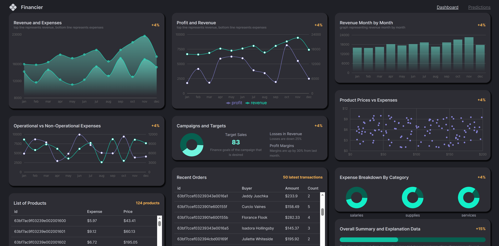

# Financier: A Fullstack MERN Finance Dashboard App | Machine Learning, Typescript, JavaScript, React, Node, Express, MongoDB, Material UI, Docker.

        

## About

Financier is a full-stack MERN Finance Dashboard App with Machine Learning predictions using Regression. 

The application's frontend utilizes Vite for starter application, Redux Toolkit for state management, Material UI for component library, and Recharts for visualization Charts. The backend of the application uses Node Js as its runtime environment, Express Js as the backend framework, and MongoDB as its database for data storage and retrieval.

The application client was deployed using Vercel, and the application server was containerized locally using Docker and deployed to Fly.io.

To learn more about the application, please visit: 

  https://financier-ten.vercel.app/ 

## Video Walkthrough

Here's a walkthrough of the implemented application features:

